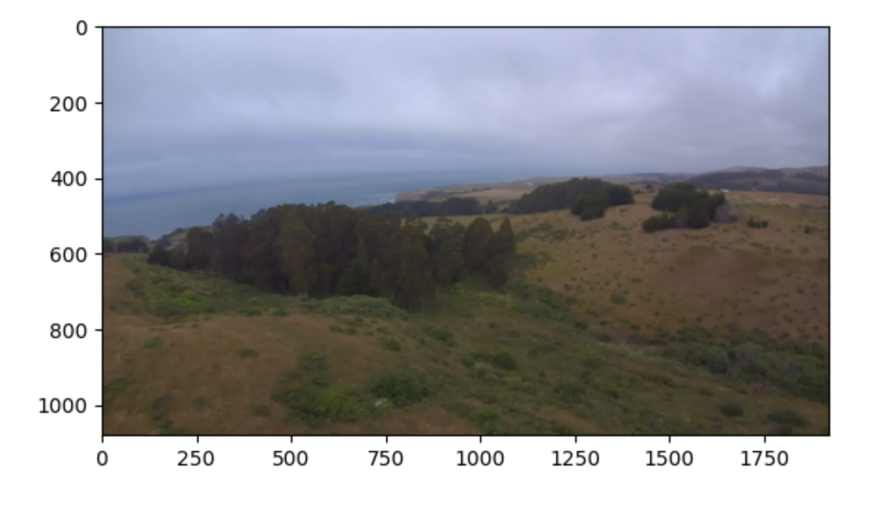
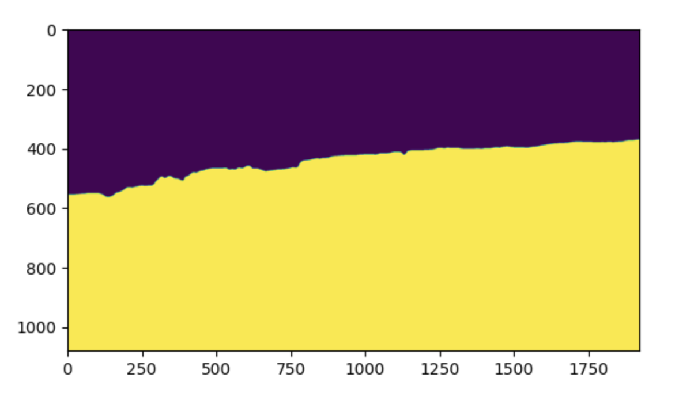
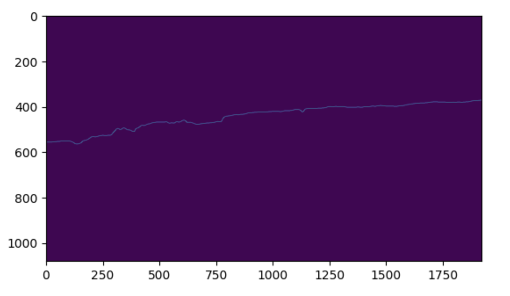
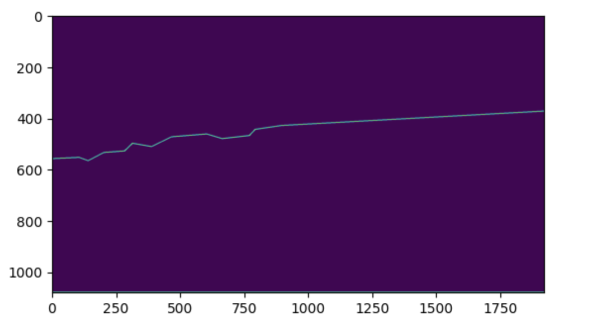
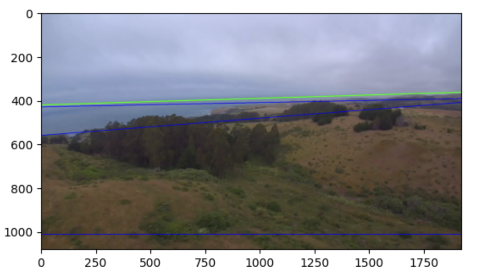
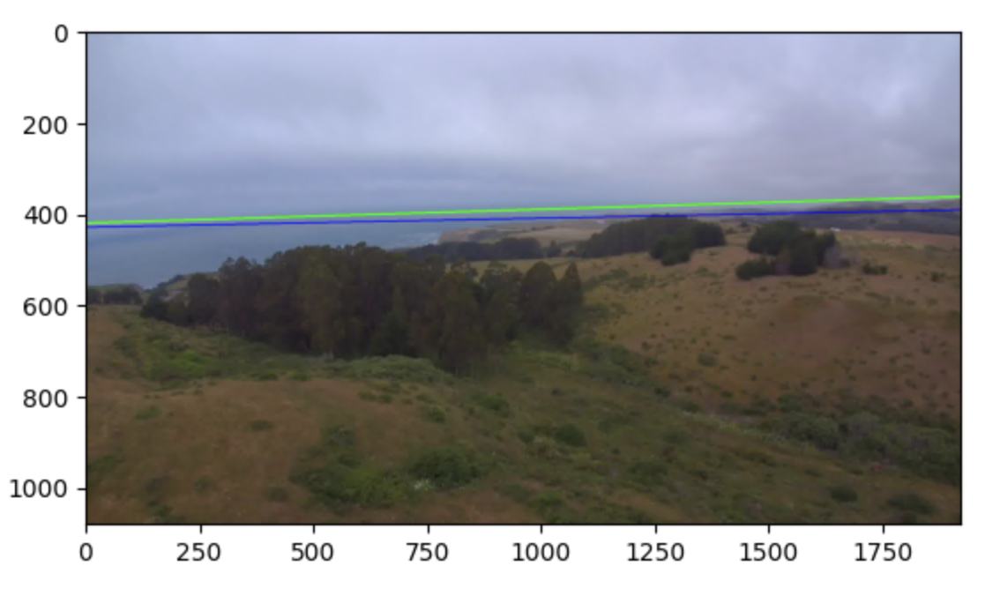

# Horizon Detection in Aerial Imagery
This repository contains a vision based approach to detecting the horizon line in RGB aerial images. This is an openCV and NumPy approach and makes some simple assumptions, described below.

## How to Run

The only required dependency is Docker. Build the container with: 

```bash
docker build -t zpl_hw .
```

Copy the input images into the `input` directory. Optionally, add a `ground_truth.json` to run metrics. After running the `runs.sh` script, the output images will appear in the `output` directory. These directories are volume mapped into the docker container by the shell script, which is just a convenient way to run the docker container.

To actually run the container, call:

```bash
./run.sh
```

NOTE: be sure it has the correct permissions! You may first need to run:

```bash
chmod 755 run.sh
```

If you intend to run the script again, be sure to clear out the contents of the `input` and `output` directories!

### Evaluation metrics

Since we are comparing two 2D straight lines, Euclidean distance is used between the predicted horizon and the actual horizon in the ground truth to determine the performance. 

These were the observed performance metrics on the two sets of input images:

```
# input_1
Min Euclidean Distance:  17.75
Max Euclidean Distance:  162.45
Mean Euclidean Distance:  62.77
Time Taken to process 150 images is 8.85 seconds

# input_2
Min Euclidean Distance:  22.05
Max Euclidean Distance:  164.24
Mean Euclidean Distance:  55.53
Time Taken to process 150 images is 8.16 seconds
```

### Assumptions

- Test image folder has the same directory and naming structure as provided input images. Images are all `.jpg` and if metrics are desired, there'll be a `ground_truth.json` file provided.
- All images are 3 channels, from the same sensor, and are in the RGB colorspace.

### Algorithm

The input data set is limited in number and has low variance. Due to the size of the dataset there is a risk of overfitting. 

At first glance, this looked like an edge detection problem. We are trying to isolate a line that divides the image into "sky" and "land".


The sequence of steps followed in this algorithm are:
1. *Spatial filters for denoising* - 
        A gaussian filter to smooth out the image and reduce the detection of noise in later steps.
1. *Land contour detection* - 
This is a multistep process outlined below:
    -  Applying edge detection to a greyscale image still results in an excessive number of false edges. It helps to do an Otsu binary threshold to the image first. This binary image roughly segregates the image into land and sky. 
    -  Binary threshold is not immune to noise. Morphological transformations like erosion and dilation help get rid of holes and peaks.
    - A very simple approach to detecting the horizon line here is to first identify the two edges of the land mask and connect them with a straight line. However, this fails when there is water in the image. 
    - For a cleaner solution, edge detection is applied next and it returns an edge that closely coincides with the horizon line. The line is really jaggedy and we need to start working towards straightening it.
    - openCV contour detection when filtered to return the longest contour, aligns with the edge of the land mask.
    - Using computational geometry, the contour line is smoothed out. As the contour becomes straighter, it approaches the true horizon, and as a bonus, fewer points are needed to describe it.
    - We now have a horizon line with some straight segments.
1. *Horizon detection with Hough transform* -
We are getting pretty close to that straight line horizon at this point. A popular straight line detection algorithm called Hough Line Transform is applied to the simplified contour image. By sequentially plotting the Hough lines, it becomes clear that the horizon line is one of the top two Hough lines.
With the use of a scoring function (adapted from McGee 2005) a cost for each short listed Hough line is calculated. The line that minimizes this cost is the horizon line. 

Some parameters were finetuned to minimize the cost function of the Hough lines. These parameters have been hard coded in this repository and have been labeled as such.

### Visualizing the algorithm

#### Input RGB image


#### Thresholded and processed image, AKA Land mask


#### Edge detection output


#### Simplified contour image


#### Top 3 best Hough lines


#### Selected Hough line, AKA Horizon line

Note: Ground truth in green and Prediction in blue

### Observations and TODOs

- When viewing results, the algorithm outperforms the ground truth in some cases.
- The algorithm struggles the most with a water edge. It is difficult to distinguish the edge between sky and water.
- The algorithm also struggles when the sun is in the frame and illuminates the clouds. Compensating for this will improve accuracy.
- Using just the blue band of input images gives better performance metrics than K-means clustering. The latter is also significantly more resource intensive.
- False positives and false negatives are both penalized equally right now. Studying how the horizon line tends to be skewed could help with a weighted penalty solution.
- We need to study distribution of the blue channel across a larger dataset to determine if this solution will remain robust. Alternatively, use more bands.
- This approach has not been tested against any other image angles and might not be altitude invariant.
- Check for resolution, sensor type and orientatin resilience.
- While there is a Gaussian filter in use, this algorithm may not be resilient to excessive noise.
- Test performance on a water horizon.
- Masking out the sun and clouds might help with detecting the water edges better.
- Improving the ground truth will help towards building supervised algorithms.
- Runtime will likely improve by provisioning more resources to Docker, multiprocessing, or not using an Apple silicon-based Mac

## Sources

https://www.cse.unr.edu/~bebis/CVIU2019.pdf - describes multiple classical techniques and compares them against each other.
Obstacle Detection for Small Autonomous Aircraft using sky segmentation - McGee et all - great paper! This is where I borrowed the cost function for the Hough lines.
https://ieeexplore.ieee.org/document/5254345 - Otsu Method and K-Means
https://ieeexplore.ieee.org/abstract/document/4041464 - Early approach
https://docs.opencv.org/4.x/d7/d4d/tutorial_py_thresholding.html
https://docs.opencv.org/3.4/d9/db0/tutorial_hough_lines.html
https://docs.opencv.org/3.4/dd/d49/tutorial_py_contour_features.html


